# Tableau
# 1. 히스토그램 
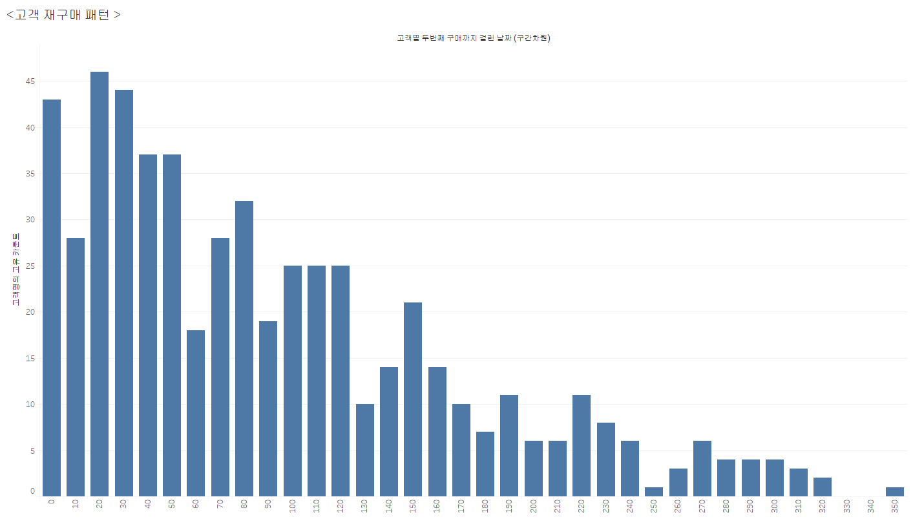
이 그래프는 고객별 두 번째 구매까지 걸린 날짜(구간 단위)와 고객들의 교차 카운트를 나타냅니다. 각 막대는 특정 구간에 해당하는 고객 수를 보여주며, 높이가 높을수록 그 구간에 해당하는 고객의 재구매 비율이 높은 것을 의미합니다. 

예를 들어, 그래프에서 100일 구간에 해당하는 막대는 고객들이 두 번째 구매까지 걸린 평균 기간이 100일임을 나타내며, 교차 카운트는 25명입니다.

# 2.고객세그먼트별 매출액 추이
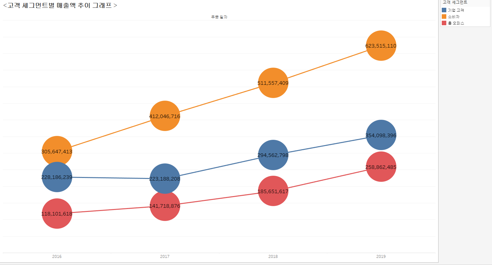

# 3. 고객 세그먼트 별 누적 막대그래프

# 4. 년도별 매출액 영역차트
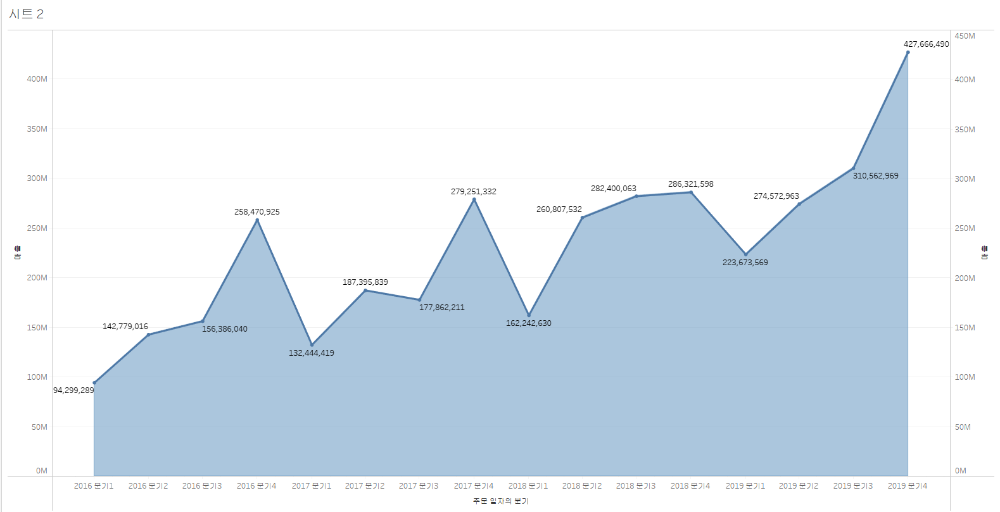

# 4. 2018년,2019년 매출액 비교 (결합축)
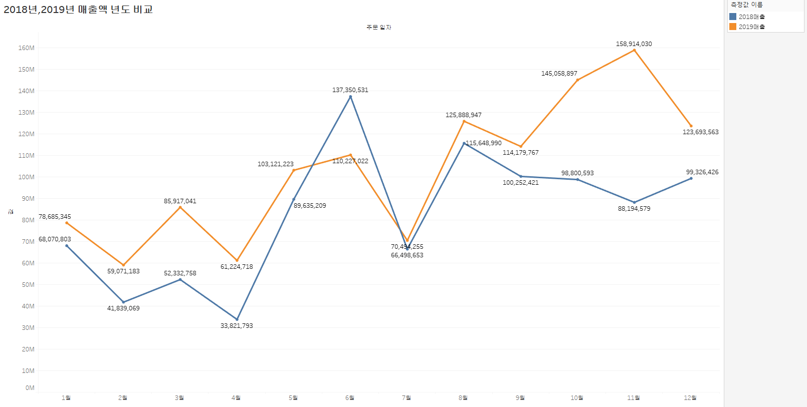

# 5. 지역별 매출액 추이 ( 라운드형 막대 그래프)

# 6. 연평균을 초가하는 년도 (평균 기준 차트)
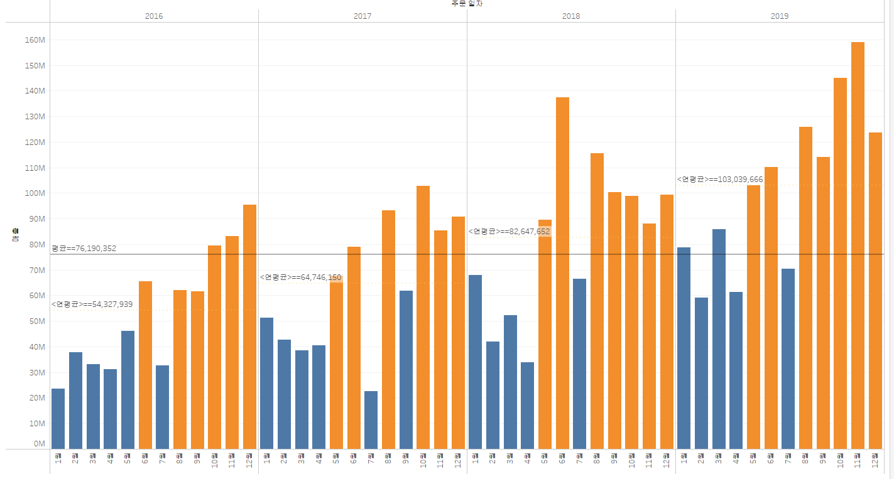

# 7. 제품 카테고리 별 계층 구조 매출 분석 
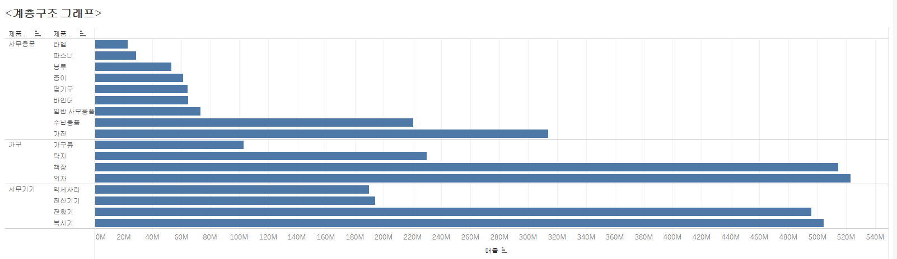

# 8. 지역별 매출의 계층 구조 분석  
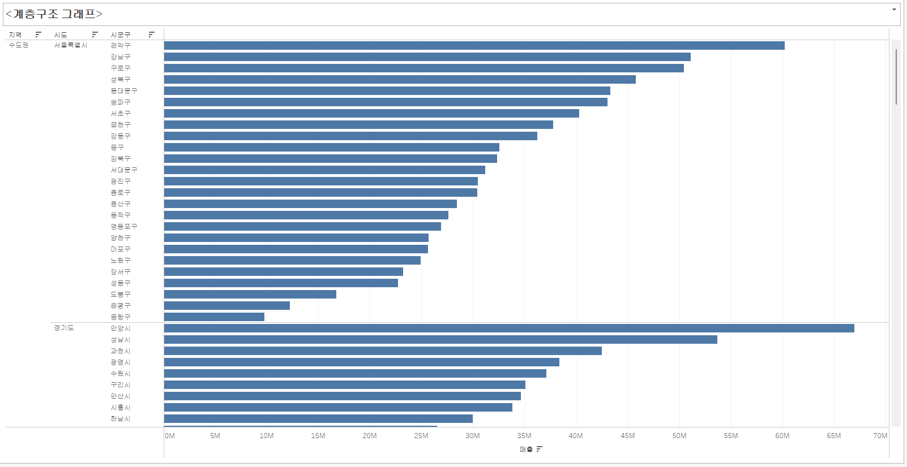

# 9. 지도그래프 (계층구조) 
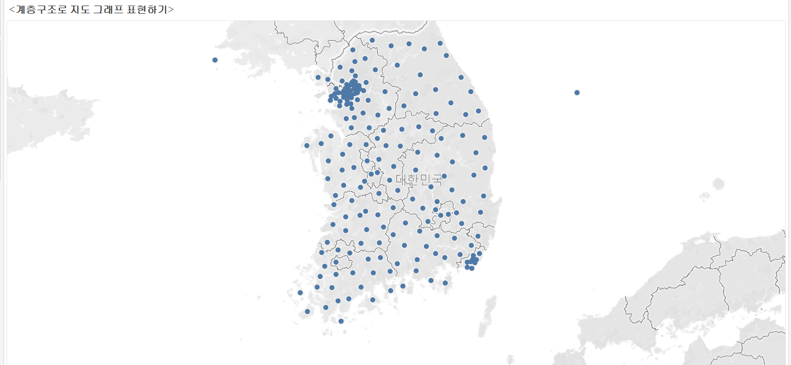

# 10. 맵채우기 그래프 
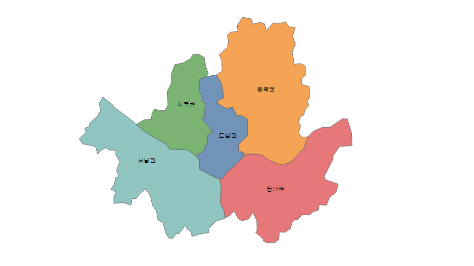

# 10. 기호맵1 
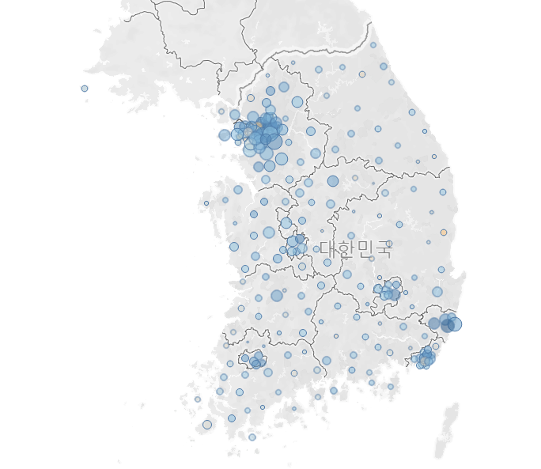

# 11. 기호맵2
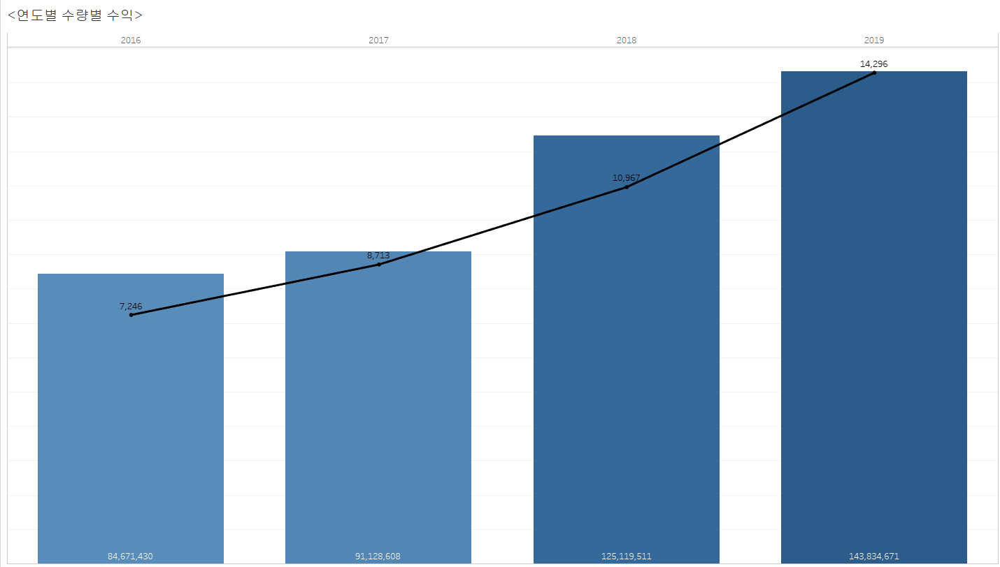
